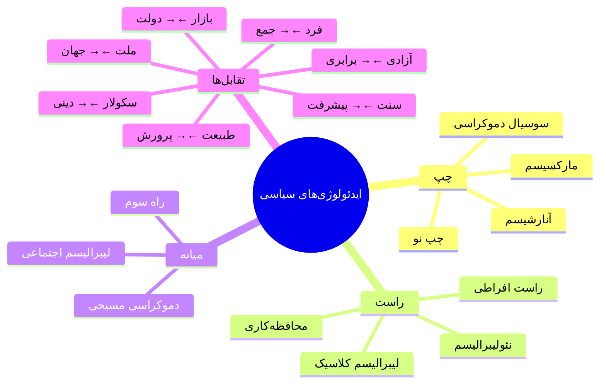

# تقابل‌های بنیادین: چگونه ایدئولوژی‌ها دنیای امروز را شکل دادند


> **توصیف تصویر جلد پیشنهادی:**
> یک ترازوی بزرگ در مرکز، با کفه‌های قرمز (چپ) و آبی (راست). در پس‌زمینه، نقشهٔ جهان با مناطق مختلف به رنگ‌های متفاوت. اشکال انسانی در حال کشیدن ترازو به دو سو. در بالا، نمادهای مختلف: چکش و داس، نماد دلار، پرچم صلح، کارخانه، گندمزار. آسمان از یک سو طوفانی و از سوی دیگر آفتابی.

---

## مقدمه: چرا ایدئولوژی‌ها مهم‌اند؟

تاریخ بشر را می‌توان تاریخ **ایده‌ها** دانست. جنگ‌ها، انقلاب‌ها، امپراتوری‌ها، و تمدن‌ها همه بر پایهٔ ایده‌هایی ساخته شده‌اند که مردم برایشان زندگی کرده و مرده‌اند.

در دو قرن گذشته، ایدئولوژی‌های سیاسی—از لیبرالیسم و سوسیالیسم گرفته تا فاشیسم و محافظه‌کاری—جهان را دگرگون کرده‌اند. این مقاله به بررسی مهم‌ترین تقابل‌های میان این ایدئولوژی‌ها و تأثیر آنها بر شکل‌گیری دنیای امروز می‌پردازد.


### بخش اول: پنج تقابل بنیادین

#### ۱. فرد در برابر جمع

این شاید اساسی‌ترین تقابل در اندیشهٔ سیاسی است.

mermaid
```
graph LR
    subgraph فردگرایی
        A[حقوق فردی مقدس] --> B[دولت خادم فرد]
        B --> C[بازار آزاد]
        C --> D[مسئولیت شخصی]
    end
    
    subgraph جمع‌گرایی
        E[منافع جمعی مقدم] --> F[فرد خادم جامعه]
        F --> G[برنامه‌ریزی مرکزی]
        G --> H[مسئولیت اجتماعی]
    end
    
    A -.تنش.- E
    D -.تنش.- H
```
جنبه	فردگرایی	جمع‌گرایی
نماینده	لیبرتارینیسم، لیبرالیسم	سوسیالیسم، کمونیسم
ارزش محوری	آزادی فردی	برابری و همبستگی
نقش دولت	حداقلی	گسترده
مالکیت	خصوصی	اجتماعی/دولتی
نقد اصلی	نابرابری و اتمیسم	سرکوب و ناکارآمدی
تأثیر تاریخی
انقلاب آمریکا (۱۷۷۶) بر فردگرایی تأکید داشت: «حق زندگی، آزادی، و جستجوی خوشبختی». این فلسفه آمریکا را به سنگر سرمایه‌داری فردگرا تبدیل کرد.

انقلاب روسیه (۱۹۱۷) بر جمع‌گرایی تأکید داشت: «از هر کس به اندازهٔ توانش، به هر کس به اندازهٔ نیازش». این فلسفه شوروی را به آزمایشگاه سوسیالیسم تبدیل کرد.

درس تاریخ: هر دو افراط به فاجعه انجامید. فردگرایی مطلق به نابرابری و بحران‌های اقتصادی؛ جمع‌گرایی مطلق به استبداد و ناکارآمدی. جوامع موفق معمولاً ترکیبی یافته‌اند.

#### ۲. برابری در برابر آزادی
mermaid
graph TB
    subgraph تنش اصلی
        A[آزادی] <--> B[برابری]
    end
    
    subgraph آزادی مطلق
        C[بازار آزاد] --> D[نابرابری طبیعی]
        D --> E[انباشت ثروت]
        E --> F[الیگارشی؟]
    end
    
    subgraph برابری مطلق
        G[بازتوزیع اجباری] --> H[کاهش انگیزه]
        H --> I[رکود اقتصادی]
        I --> J[دولت قوی] --> K[استبداد؟]
    end
    
    A --> C
    B --> G
نقل‌قول‌های کلیدی
«آزادی بدون برابری، آزادی قوی‌تر برای خوردن ضعیف‌تر است.»
— میخائیل باکونین

«جامعه‌ای که آزادی را فدای برابری کند، نه برابری خواهد داشت نه آزادی.»
— میلتون فریدمن

جدول مقایسه‌ای دیدگاه‌ها
مکتب	اولویت	استدلال
لیبرتارینیسم	آزادی	برابری اجباری، سرکوب است
سوسیالیسم	برابری	آزادی بدون منابع، بی‌معناست
لیبرالیسم اجتماعی	توازن	آزادی و برابری مکمل‌اند
محافظه‌کاری	نظم	هر دو باید در چارچوب سنت باشند
۳. دولت در برابر بازار
mermaid
graph LR
    subgraph طیف دخالت دولت
        A[آنارشیسم<br>دولت صفر] --> B[لیبرتارینیسم<br>دولت حداقلی]
        B --> C[لیبرالیسم کلاسیک<br>دولت محدود]
        C --> D[لیبرالیسم اجتماعی<br>دولت تنظیمی]
        D --> E[سوسیال دموکراسی<br>دولت رفاه]
        E --> F[سوسیالیسم<br>دولت مالک]
        F --> G[کمونیسم<br>دولت همه‌کاره]
    end
    
    style A fill:#f9f,stroke:#333
    style G fill:#f66,stroke:#333
    style D fill:#9f9,stroke:#333

### بحران‌های تاریخی و واکنش‌ها

mermaid
timeline
    title واکنش به بحران‌ها: دولت یا بازار؟
    
    1929 : بحران بزرگ
         : شکست بازار
         : واکنش: نیو دیل، دولت رفاه
    
    1970s : رکود تورمی
          : شکست کینزگرایی
          : واکنش: نئولیبرالیسم
    
    2008 : بحران مالی
         : شکست مقررات‌زدایی
         : واکنش: نجات دولتی، بازگشت تنظیم
    
    2020 : پاندمی کرونا
         : شکست سیستم بهداشت
         : واکنش: دخالت گستردهٔ دولت

### تحلیل انتقادی

ادعای نئولیبرالیسم: بازار آزاد بهترین تخصیص‌دهندهٔ منابع است.

واقعیت: بحران ۲۰۰۸ نشان داد که بازارهای مالی بدون تنظیم به بحران سیستمیک می‌انجامند. همان دولت‌هایی که «کوچک» بودند، مجبور شدند تریلیون‌ها دلار برای نجات بانک‌ها بپردازند.

ادعای سوسیالیسم دولتی: برنامه‌ریزی مرکزی کارآمدتر است.

واقعیت: فروپاشی شوروی نشان داد که برنامه‌ریزی مرکزی نمی‌تواند با پیچیدگی اقتصاد مدرن کنار بیاید. صف‌های نان و کمبود کالا نشانهٔ شکست بود.

۴. سنت در برابر پیشرفت
mermaid
graph TB
    subgraph محافظه‌کاری
        A[سنت آزموده شده] --> B[تغییر تدریجی]
        B --> C[احترام به نهادها]
        C --> D[هشدار نسبت به آرمانشهر]
    end
    
    subgraph پیشروی
        E[سنت = ستم انباشته] --> F[تغییر بنیادین]
        F --> G[نقد نهادها]
        G --> H[امکان جهان بهتر]
    end
    
    subgraph نتایج تاریخی
        I[محافظه‌کاری افراطی: رکود]
        J[پیشروی افراطی: انقلاب خونین]
        K[توازن: اصلاح پایدار]
    end
    
    A --> I
    E --> J
    B --> K
    F --> K
مطالعهٔ موردی: انقلاب فرانسه
مرحله	رویکرد	نتیجه
۱۷۸۹-۱۷۹۱	اصلاح‌طلبی میانه	قانون اساسی، حقوق بشر
۱۷۹۲-۱۷۹۴	رادیکالیسم ژاکوبنی	ترور، هزاران اعدام
۱۷۹۴-۱۷۹۹	واکنش ترمیدوری	بی‌ثباتی
۱۷۹۹-۱۸۱۵	ناپلئون	استبداد نظامی
۱۸۱۵-۱۸۳۰	بازگشت سلطنت	ارتجاع
درس: تغییر بیش از حد سریع، واکنش می‌آورد. اما مقاومت در برابر تغییر هم به انفجار می‌انجامد.

۵. ملت در برابر جهان
mermaid
graph LR
    subgraph ناسیونالیسم
        A[هویت ملی] --> B[حاکمیت ملی]
        B --> C[منافع ملی اول]
        C --> D[مرزهای کنترل‌شده]
    end
    
    subgraph انترناسیونالیسم
        E[همبستگی جهانی] --> F[نهادهای فراملی]
        F --> G[منافع مشترک بشری]
        G --> H[مرزهای باز]
    end
    
    A -.تنش.- E
    D -.تنش.- H
    
    subgraph پیامدها
        I[جنگ جهانی: ناسیونالیسم افراطی]
        J[اتحادیهٔ اروپا: انترناسیونالیسم]
        K[برگزیت: واکنش ناسیونالیستی]
    end
بخش دوم: ایدئولوژی‌ها و شکل‌دهی به نظام بین‌المللی
معاهدات و توافقات کلیدی
mermaid
timeline
    title معاهدات کلیدی و بازیگران ایدئولوژیک
    
    1945 : سازمان ملل متحد
         : پیشنهاددهنده: لیبرالیسم بین‌المللی (آمریکا، بریتانیا)
         : حامی: همه (ظاهراً)
         : منتقد: واقع‌گرایان (حاکمیت ملی)
    
    1948 : اعلامیهٔ جهانی حقوق بشر
         : پیشنهاددهنده: لیبرالیسم غربی
         : حامی: اکثر کشورها
         : منتقد: شوروی، عربستان (حق رأی)
    
    1957 : معاهدهٔ رم (اتحادیهٔ اروپا)
         : پیشنهاددهنده: دموکرات‌های مسیحی، فدرالیست‌ها
         : منتقد: ناسیونالیست‌ها، چپ رادیکال
    
    1992 : پروتکل کیوتو
         : پیشنهاددهنده: جنبش سبز، چپ
         : حامی: اتحادیهٔ اروپا
         : منتقد: آمریکا، راست محافظه‌کار
    
    2015 : توافق پاریس (اقلیم)
         : پیشنهاددهنده: لیبرالیسم بین‌المللی، جنبش سبز
         : حامی: اکثر کشورها
         : منتقد: ترامپ، پوپولیست‌های راست
تحلیل: چه کسی چه می‌خواست؟
معاهده	حامیان	مخالفان	نتیجه
سازمان ملل	لیبرال‌های بین‌المللی	واقع‌گرایان (ضمنی)	موفقیت نسبی
برتون وودز	لیبرالیسم اقتصادی آمریکا	کشورهای در حال توسعه	دلار محور شد
ناتو	ضد کمونیسم غربی	شوروی، چپ	جنگ سرد
اتحادیهٔ اروپا	فدرالیست‌ها، لیبرال‌ها	ناسیونالیست‌ها	موفقیت تا برگزیت
WTO	نئولیبرالیسم	چپ، حمایت‌گرایان	جهانی‌سازی
توافق پاریس	چپ، سبزها، لیبرال‌ها	راست پوپولیست	شکننده
بخش سوم: چالش‌های درونی مکاتب
چالش‌های درونی چپ
mermaid
graph TB
    subgraph چپ
        A[مارکسیسم] --> B{انشعاب}
        B --> C[لنینیسم: انقلاب پیشاهنگ]
        B --> D[سوسیال دموکراسی: اصلاح]
        B --> E[تروتسکیسم: انقلاب مداوم]
        B --> F[مائوئیسم: دهقانان]
        
        C --> G[استالینیسم]
        D --> H[راه سوم؟]
    end
    
    subgraph پرسش‌های درونی
        I[انقلاب یا اصلاح؟]
        J[دیکتاتوری پرولتاریا چقدر؟]
        K[بازار یا برنامه؟]
        L[ملی یا بین‌المللی؟]
    end
تقابل تاریخی: رزا لوکزامبورگ در برابر لنین
موضوع	لنین	لوکزامبورگ
حزب	پیشاهنگ نخبه	دموکراتیک توده‌ای
انقلاب	توطئه‌ای	خودانگیختهٔ توده‌ها
دموکراسی	تعلیق موقت	ضروری همیشه
ملت	حق تعیین سرنوشت	انترناسیونالیسم
لوکزامبورگ دربارهٔ انقلاب روسیه:
«آزادی فقط برای حامیان حکومت، آزادی نیست. آزادی همیشه آزادی دگراندیشان است.»

چالش‌های درونی راست
mermaid
graph TB
    subgraph راست
        A[محافظه‌کاری] --> B{انشعاب}
        B --> C[پالئوکنسرواتیسم: سنت]
        B --> D[نئوکنسرواتیسم: مداخله]
        B --> E[لیبرتارینیسم: بازار]
        B --> F[راست مسیحی: ارزش‌ها]
        
        C -.تنش.- D
        E -.تنش.- F
    end
    
    subgraph پرسش‌های درونی
        G[آزادی اقتصادی یا ارزش‌های اخلاقی؟]
        H[انزواطلبی یا امپریالیسم؟]
        I[بازار آزاد یا ملی‌گرایی اقتصادی؟]
        J[نخبه‌گرایی یا پوپولیسم؟]
    end
تقابل: بوکانان در برابر بوش‌ها
موضوع	پالئوکنسرواتیسم (بوکانان)	نئوکنسرواتیسم (بوش)
تجارت	حمایت‌گرایی	تجارت آزاد
مهاجرت	محدود	نسبتاً باز
سیاست خارجی	انزواطلبی	مداخله‌جویی
اسرائیل	انتقادی	حمایت قوی
جنگ عراق	مخالف	حامی
بخش چهارم: ایدئولوژی‌ها در عمل - تناقضات
وقتی ادعا با عمل نمی‌خواند
mermaid
graph LR
    subgraph ادعا
        A[آمریکا: آزادی و دموکراسی]
        B[شوروی: برابری و عدالت]
        C[چین: سوسیالیسم]
    end
    
    subgraph عمل
        D[حمایت از دیکتاتورها]
        E[گولاگ و سرکوب]
        F[سرمایه‌داری دولتی]
    end
    
    A --> D
    B --> E
    C --> F
جدول تناقضات
بازیگر	ادعای ایدئولوژیک	عمل متناقض
آمریکا (جنگ سرد)	دموکراسی و آزادی	حمایت از پینوشه، شاه، سوهارتو
شوروی	رهایی‌بخشی	سرکوب مجارستان، چکسلواکی
بریتانیا	تمدن و پیشرفت	استعمار و استثمار
فرانسه	حقوق بشر	جنگ الجزایر
چین	کمونیسم	میلیاردرها و نابرابری
اتحادیهٔ اروپا	حقوق بشر	سیاست ضد مهاجرت
درس: ایدئولوژی‌ها اغلب توجیه‌گر منافع‌اند، نه راهنمای عمل. واقع‌گرایی سیاسی معمولاً بر آرمان‌گرایی غلبه می‌کند.

بخش پنجم: نقشهٔ جهان ایدئولوژیک
تغییرات تاریخی
mermaid
graph TB
    subgraph 1945-1991: جنگ سرد
        A[غرب: سرمایه‌داری لیبرال] <--> B[شرق: سوسیالیسم دولتی]
        C[جهان سوم: میدان رقابت]
    end
    
    subgraph 1991-2008: پیروزی لیبرالیسم
        D[پایان تاریخ؟]
        E[گسترش دموکراسی]
        F[جهانی‌سازی]
    end
    
    subgraph 2008-امروز: بحران
        G[بازگشت اقتدارگرایی]
        H[پوپولیسم]
        I[رقابت آمریکا-چین]
    end
    
    A --> D
    B --> D
    D --> G
    E --> H
    F --> I
وضعیت امروز
منطقه	گرایش غالب	چالش اصلی
آمریکای شمالی	لیبرالیسم (در بحران)	قطبی‌شدن، پوپولیسم
اروپای غربی	سوسیال دموکراسی/لیبرالیسم	راست افراطی، مهاجرت
اروپای شرقی	ناسیونالیسم محافظه‌کار	اقتدارگرایی
چین	اقتدارگرایی سرمایه‌دارانه	رقابت با غرب
روسیه	اقتدارگرایی ناسیونالیستی	انزوای بین‌المللی
خاورمیانه	اقتدارگرایی/اسلام‌گرایی	بی‌ثباتی
آمریکای لاتین	نوسان چپ-راست	نابرابری، فساد
آفریقا	متنوع	توسعه، دموکراسی شکننده
بخش ششم: درس‌ها برای امروز و فردا
چه آموختیم؟
mermaid
graph TB
    subgraph درس‌های تاریخ
        A[افراط خطرناک است] --> B[چپ افراطی: استالین]
        A --> C[راست افراطی: هیتلر]
        
        D[ایدئولوژی ابزار است] --> E[توجیه منافع]
        
        F[تغییر اجتناب‌ناپذیر است] --> G[مقاومت = انفجار]
        
        H[بازار و دولت هر دو لازم‌اند] --> I[نه آنارشی، نه توتالیتاریسم]
    end
ده اصل برای سیاست‌ورزی
افراط نکن. تاریخ نشان داده که افراط چپ و راست هر دو به فاجعه می‌انجامد.

به شواهد توجه کن. ایدئولوژی راهنماست، نه دین. اگر واقعیت با نظریه نخواند، نظریه را اصلاح کن.

تنوع را بپذیر. جوامع پیچیده‌اند. یک راه‌حل برای همه جواب نمی‌دهد.

نهادها مهم‌اند. انقلاب‌های بدون نهاد به هرج‌ومرج می‌انجامند.

حقوق فردی و مسئولیت اجتماعی هر دو لازم‌اند. نه فردگرایی مطلق، نه جمع‌گرایی مطلق.

منتقد خودت باش. هر ایدئولوژی نقاط کور دارد.

با مخالفان گفتگو کن. دشمن‌سازی راه به جایی نمی‌برد.

تغییر تدریجی معمولاً پایدارتر است. انقلاب‌ها اغلب فرزندان خود را می‌خورند.

قدرت فاسد می‌کند. کنترل و توازن ضروری است.

آینده باز است. نه «پایان تاریخ» و نه «تکرار ابدی».

نتیجه‌گیری: آیندهٔ ایدئولوژی
mermaid
graph LR
    subgraph سناریوهای آینده
        A[تداوم تقابل چپ-راست] --> B[با تعدیل]
        C[شکاف‌های جدید] --> D[سبز/قهوه‌ای، باز/بسته]
        E[پایان ایدئولوژی؟] --> F[تکنوکراسی]
        G[بازگشت تقابل‌های بنیادین] --> H[بحران اقلیم، هوش مصنوعی]
    end
چپ و راست احتمالاً نخواهند مرد. این مفاهیم بیش از دو قرن است که زنده‌اند و به تنش‌های واقعی در جامعهٔ انسانی (برابری/آزادی، فرد/جمع، تغییر/ثبات) می‌پردازند.

اما این مفاهیم تغییر خواهند کرد. چالش‌های جدید—تغییر اقلیم، هوش مصنوعی، نابرابری جهانی—ممکن است ترکیب‌های جدیدی از ایده‌های قدیمی بیافرینند.

آنچه مهم است، توانایی ماست برای اندیشیدن دربارهٔ این مسائل. این کتاب تلاشی بود برای فراهم کردن ابزارهای این اندیشه.

پیوست: نمودار جامع تقابل‌ها
mermaid
graph TB
    subgraph تقابل‌های بنیادین
        A[فرد ←→ جمع]
        B[آزادی ←→ برابری]
        C[سنت ←→ پیشرفت]
        D[ملت ←→ جهان]
        E[بازار ←→ دولت]
        F[سکولار ←→ دینی]
        G[طبیعت ←→ پرورش]
    end
    
    subgraph مکاتب اصلی
        H[لیبرالیسم] --> A
        H --> B
        I[سوسیالیسم] --> A
        I --> B
        J[محافظه‌کاری] --> C
        J --> F
        K[ناسیونالیسم] --> D
        L[آنارشیسم] --> E
    end
پایان مقاله

برای مطالعهٔ بیشتر:

کتاب «راست یا چپ؛ میانه کجاست؟» نوشتهٔ مهدی سالم
فصل‌های ۱ تا ۱۷ برای بررسی تفصیلی هر مکتب
ضمائم برای شخصیت‌ها، واژه‌نامه، و تایم‌لاین